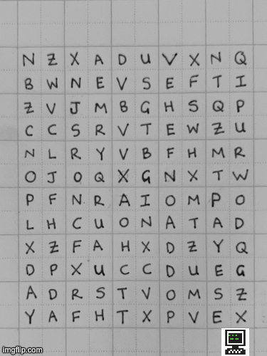

# Never Graduate

Small program that uses OCR to extract the phrase "NEVER GRADUATE" from a hand-drawn
grid of letters. This project uses OpenCV2 for image manipulation and Pytesseract is used for OCR.

## How it works

The program first preprocesses the image, converting it to grayscale and thresholding to leave behind
just the characters. Then an OCR model is used to identify all the characters from the images
(Note: Not all are identified correctly but the ones we care about are ;p). Some post-processing
is then applied to remove false positives.

Finally, the identified characters are sorted from top-left to bottom-right and then valid combinations
of "NEVER GRADUATE" are identified from this set. Using this, all other characters are blanked out leaving behind
the desired phrase.



## Install
This package uses python 3.7 and tesseract.

```
brew install tesseract
pip install -r requirements.txt
```

## Run
```
python3 ocr.py
```